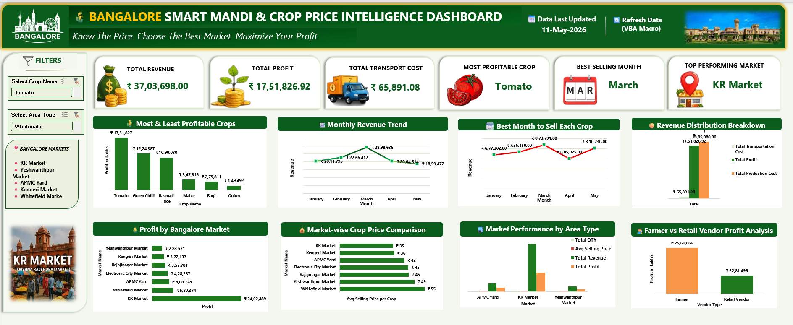

# Bangalore Smart Mandi & Crop Price Intelligence Dashboard

## Project Overview

This project analyzes crop prices, profitability, and selling trends across Bangalore mandi markets using Excel dashboards and automation techniques.

The dashboard helps identify:
- Most profitable crops
- Best selling months
- High-performing markets
- Wholesale vs Retail performance
- Vendor profitability trends

The project was built using Microsoft Excel, Power Query, Pivot Tables, VBA Macros, and interactive dashboarding techniques.

---

## Business Problem

Farmers and vendors often struggle to decide:
- Which market gives better prices
- Which crop generates higher profit
- When to sell crops for maximum profitability

Due to price fluctuations across Bangalore markets, poor selling decisions can reduce profitability significantly.

This project helps solve these challenges using data-driven insights and interactive reporting.

---

## Tools & Skills Used

- Microsoft Excel
- Power Query (ETL)
- Pivot Tables & Pivot Charts
- VBA Macros
- Data Cleaning
- Dashboard Design
- XLOOKUP
- SUMIFS
- INDEX-MATCH
- Interactive Slicers

---

## Dataset Information

The dataset includes:
- Crop names
- Bangalore market locations
- Quantity sold
- Selling price per KG
- Production cost per KG
- Transportation costs
- Vendor types
- Revenue calculations
- Profit calculations
- Monthly sales trends

The dataset was intentionally designed with messy and inconsistent data to perform realistic data cleaning and transformation tasks.

---

## Data Cleaning & ETL Process

The following data cleaning operations were performed:
- Removed duplicate records
- Standardized crop names
- Fixed inconsistent date formats
- Handled missing values
- Corrected pricing inconsistencies
- Converted incorrect data types

Power Query was used to:
- Import raw datasets
- Transform columns
- Merge datasets
- Create calculated fields
- Automate refresh operations

---

## Dashboard Features

The dashboard includes:
- Dynamic KPI Cards
- Crop-wise Profit Analysis
- Monthly Revenue Trends
- Market-wise Pricing Analysis
- Wholesale vs Retail Comparison
- Vendor Profitability Comparison
- Revenue Distribution Analysis
- Interactive Slicers & Filters
- Automated Dashboard Refresh using VBA Macros

---

## Key Insights

- KR Market generated the highest overall profit among Bangalore mandi markets
- Tomato was identified as the most profitable crop
- March showed the highest overall selling profitability
- Retail markets provided better selling prices for premium crops
- Transportation costs significantly impacted low-margin crops

---

## Recommendations

- Farmers should prioritize selling high-margin crops during peak demand months
- KR Market and Yeshwanthpur Market showed better profitability potential
- Transportation costs should be optimized to improve overall margins
- Seasonal pricing trends should be monitored before selling decisions

---

## VBA Automation

A VBA Macro was implemented to automate:
- Power Query refresh
- Pivot Table updates
- Dashboard recalculations
- Chart refresh operations

This reduced manual reporting effort and improved dashboard usability.

---

## Conclusion

This project demonstrates how data analytics can support agricultural decision-making through interactive reporting, automation, and business intelligence techniques.

The dashboard simplifies complex market data into actionable insights for farmers, vendors and market analysts.
